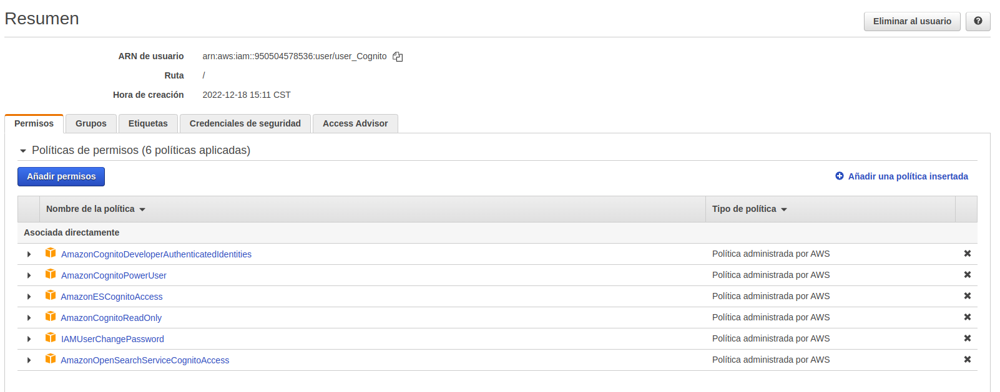

# Manual tecnico
## Objetivos

#### General
- Conjuntar los conocimientos del uso de un framework junto con NodeJS y JSON para realizar una aplicacion con funcionamiento en la nube.

#### Especificos

- Proporcionar un frontend intuitivo y vistoso para que el usuario pueda utilizarla de manera optima.
- Combinar un servidor de NodeJs con archivos JSON para manejar y atender las diferentes peticiones que requeria hacer el usuario.
-  Aprender sobre el levantamiento de una aplicacion en la nube por medio de las instancias de EC2 y el uso de servicios que proporciona AWS.

## Arquitectura

La arquitectura presenta la infraestructura que se realiza. En primer lugar tenemos la computadora la cual representa desde donde el usuario utilizara la aplicacion. Luego tenemos la representacion de las dos instancias EC2 en donde la primera muestra la utilizada para frontend junto con el logo de React representando el framework utilizado y apoyado con nginx para que pueda ser mostrada la aplicacion. La segunda instancia representa el backend que, al igual que la primera, representa el apoyo de nginx y la utilizacion de node js como servidor de consultas. Por último, se representan las conexiones hacia los servicios de bucket (para almacenar imagenes) y cognito (para el manejo de usuario). Todos estos rodeados por un cuadro representando que estan en la nube de AWS.

## Usuarios IAM

- user_EC2:

Este usuario posee la política de Full Access para las instancias EC2.

- user_Bucket:

Este usuario fue configurado con las politicas de permisos mostradas en la imagen con el fin que este posea todos los permisos en el servicio de S3.

- user_Cognito:

En el caso de este usuario se les dieron todas las politicas de permisos que estuvieran relacionadas con cognito para que este posea todo lo necesario para la gestión de cognito.

## Servicios

- Instancia EC2 (Frontend y Backend): 

Tanto en la instancia del frontend como en el backend se eligio la misma configuracion la cual se busco que siempre fuera compatible con la prueba gratuita.

- Cognito:

Se creo el grupo de usuarios en el que se estaran creando lo usuarios con su respectivo dominio y cliente de aplicación.

- Bucket:

La Bucket fue configurada con todas las configuraciones predeterminadas al momento de crear una instancia de este tipo.

## Conclusiones

- Se utilizo el framework de react junto con boostrap los cuales permiten diseñar un frontend vistoso y facil de entender para el usuario en las tareas que desee realizar.
- Es fundamental que se tengan estas cercanias con el uso de un framework ya que hoy en dia es fundamental el manejo de un frontend, el crear un backend funcional y poderlo conectar con el front para realizar peticiones y el fundamentalmente aprender de herramientas para poder subir proyectos a la nube apegandose a las corrientes de tecnologia de hoy en dia.