# Manual de usuario
## Objetivos

#### General
- Presentarle a los diferentes tipos de usuarios una aplicacion funcional e intuitiva en la nube para poder realizar todas las gestiones necesarias dentro de AviCar.

#### Especificos

- Permitir al usuario turista poder realizar sus reservaciones para viajes y automoviles de manera facil.
- Proporcionar las herramientas al usuario administrador para realizar las diferentes gestiones que requiere.
- Dar acceso intuitivo a las funciones de aceptar/rechazar.

## Descripción de la aplicación

En el frontend la aplicacion se le presentará la opcion de iniciar sesión o registrarse. Dentro de la aplicación, segun el tipo de usuario con el que ingrese, se le presentara el menu con diferentes opciones. Esta aplicación realizara las solicitudes y almacenamiento de informacion se realizará en un backend en otro servicio de la nube.

## Pasos para utilizar la aplicacion

Todos los usuarios se les peresentara la siguiente pantalla para que puedan iniciar sesión:

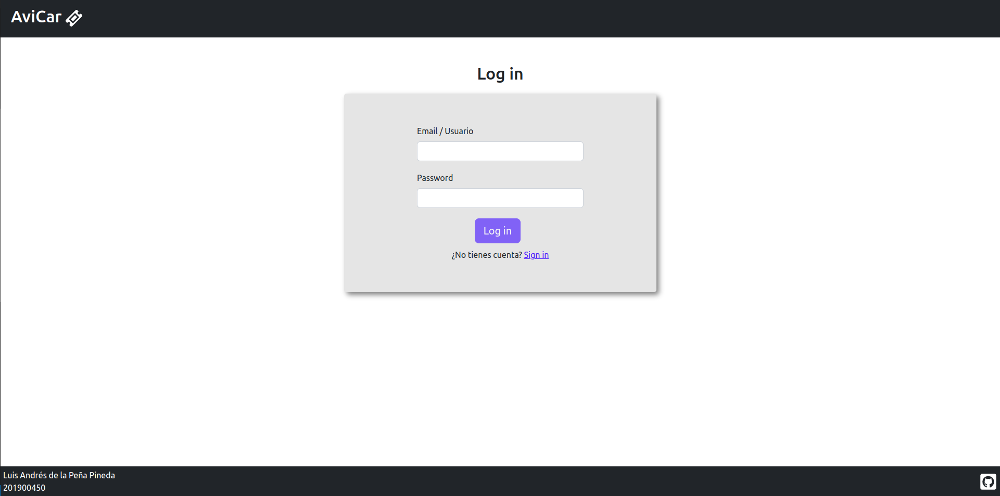

###### *Descripcion: Pantalla de inicio de sesion*

#### Turistas

En la pantalla de registro se podran registrar unicamente usuarios tipo turistas.

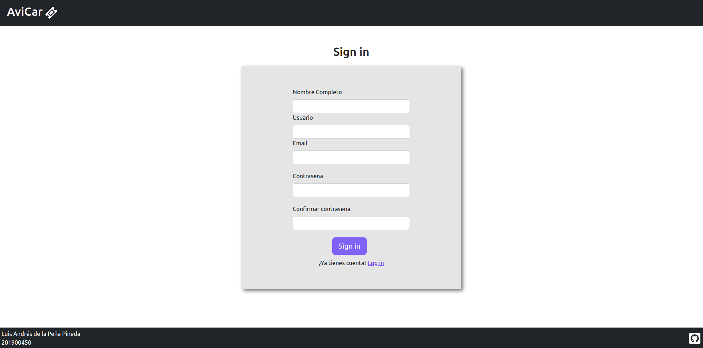

###### *Descripcion: Pantalla de regitro se usuario turista*

En el menu tendra las opciones en las que puede realizar una reservacion.

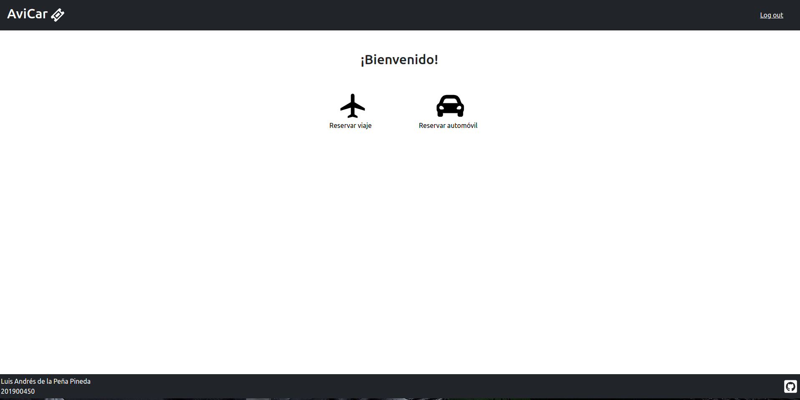

###### *Descripcion: reservación de viaje o reservacion de automovil*

Tanto la opcion de viajes como en la de automoviles se le desplegaran todos las opciones que hay y podra reservar unicamente los disponibles.

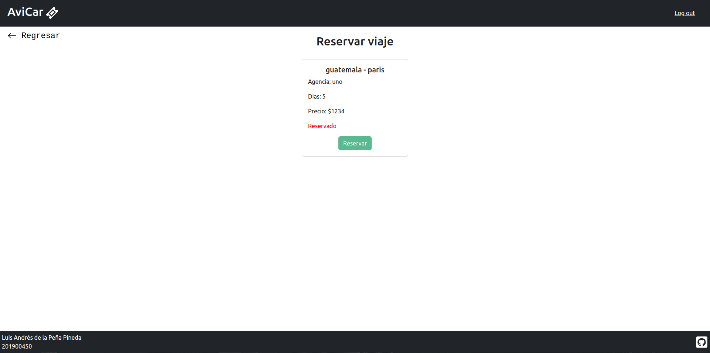

###### *Descripcion: reservación de viaje*

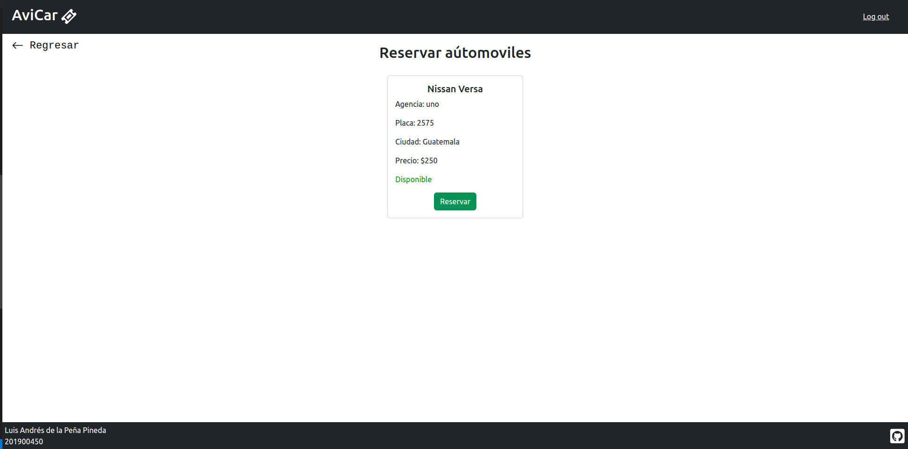

###### *Descripcion: reservación de automovil*

#### Administrador

En el menu de opciones se le presentan todas las opciones de gestion que necesita el administrador.

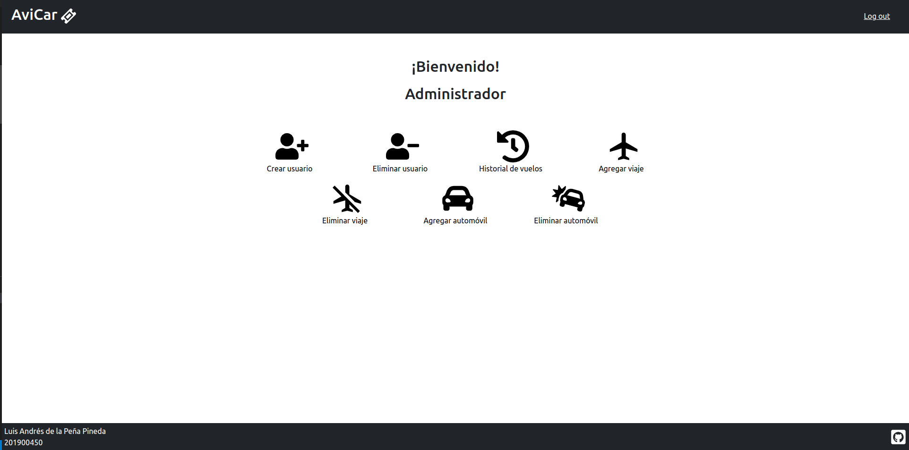

Las opciones que posee son:

- Crear Usuario: Puede crear un usario de los tres tipos (Recepcionista, turista o administrador).

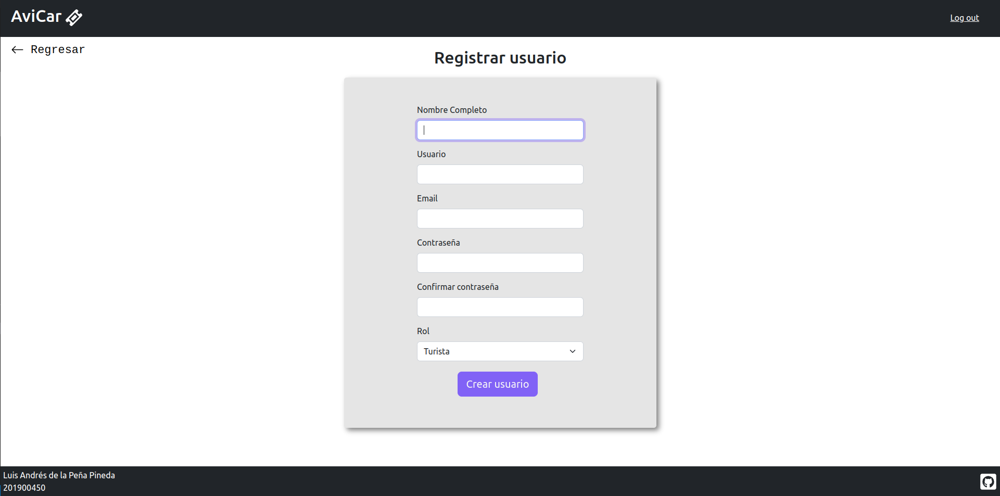

- Eliminar Usuario: A traves de nombre de usuario con el que se registro se podra eliminar un usuario.

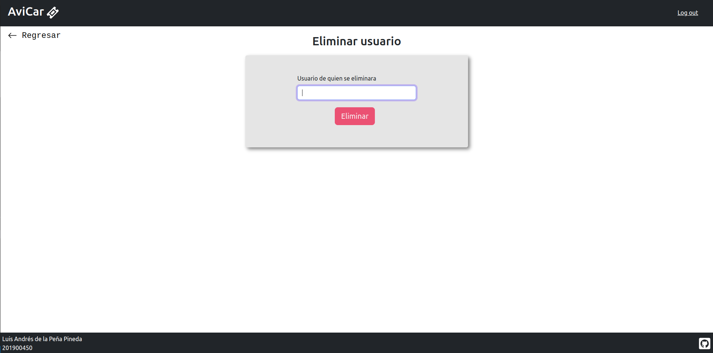

- Historial: Podra revisar el historial de las reservaciones que se hanrealizado.

- Agregar Viaje: En esta opcion se podran crear viajes nuevos.

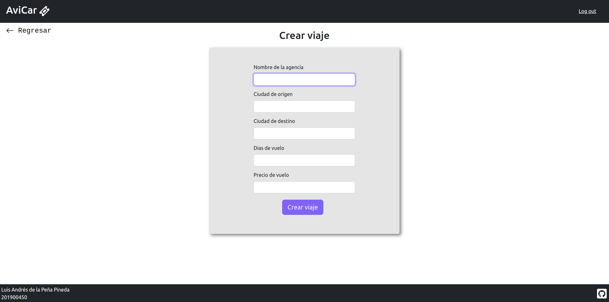

- Eliminar Viaje: Aqui podra eliminar el viaje para quitarlo de las reservaciones.

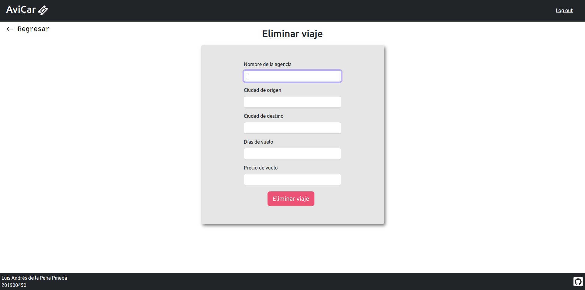

- Agregar Carro: En esta opcion se podran crear carros nuevos.

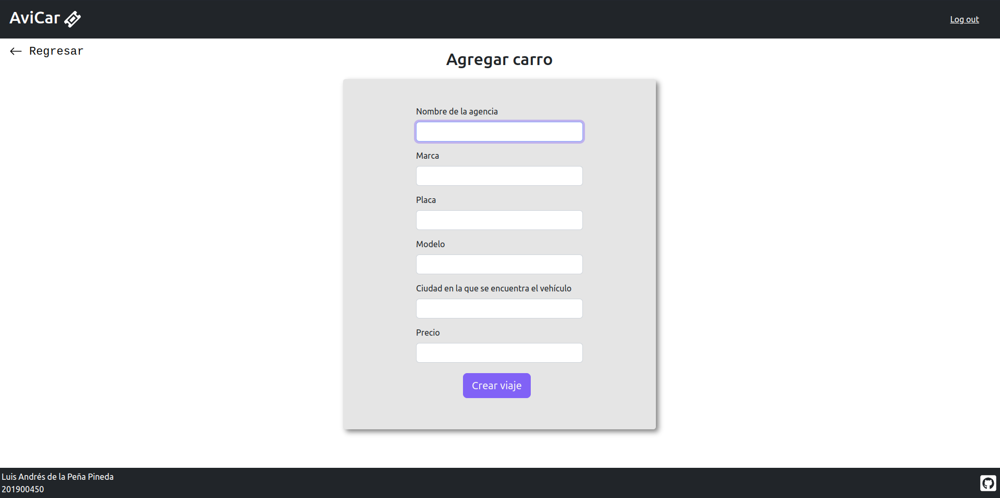

- Eliminar Carro: Aqui podra eliminar el carro para quitarlo de las reservaciones .

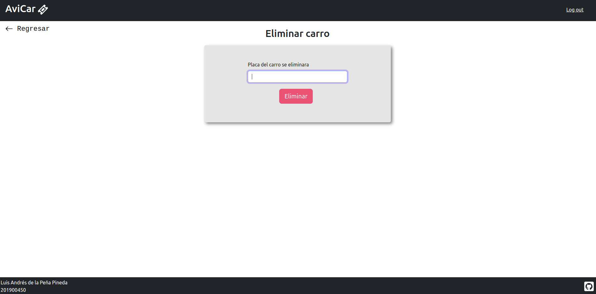

#### Recepcionista

En el menu tendra las opciones en las que puede revisar los viajes y carros.

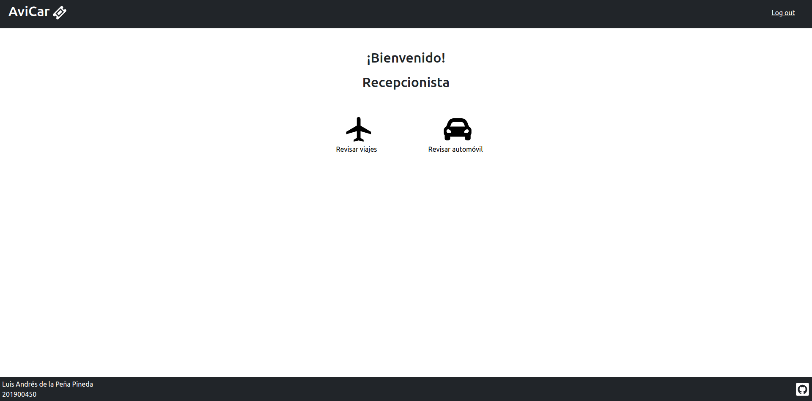

###### *Descripcion: revision de viaje o reservacion de automovil*

Tanto la opcion de viajes como en la de automoviles se le desplegaran todos las opciones que hay y podra reservar unicamente los disponibles.

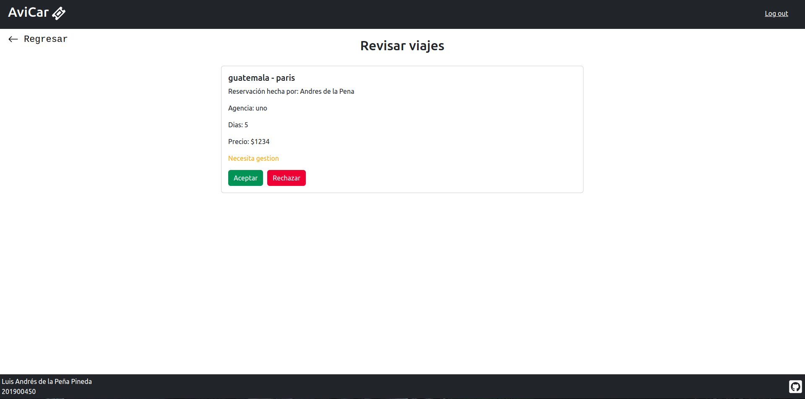

###### *Descripcion: revision de viaje*

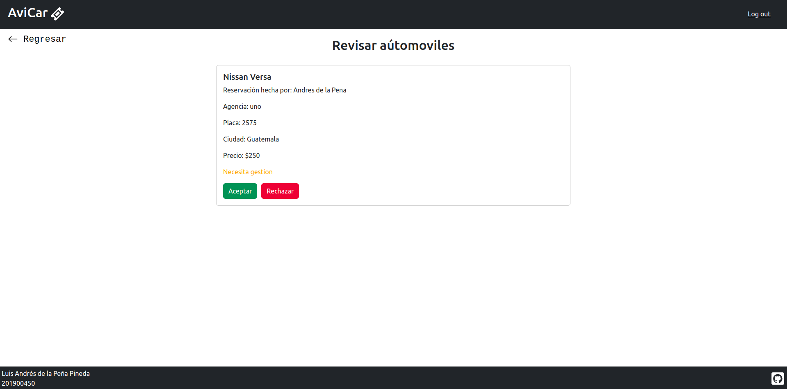

###### *Descripcion: revision de automovil*

